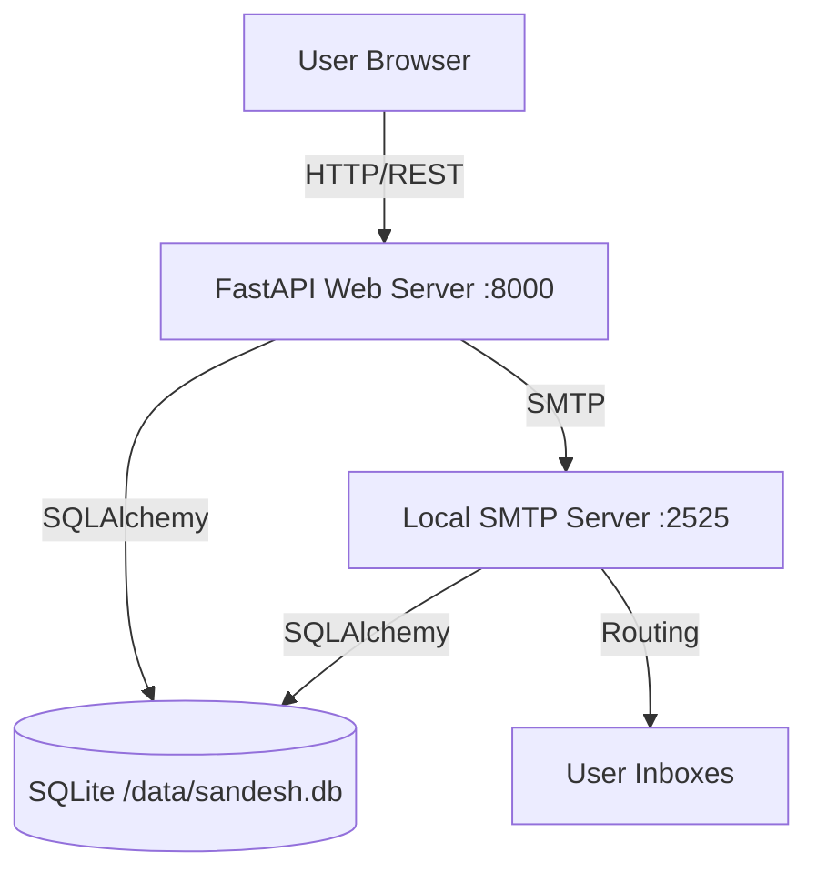

# Sandesh Technical Documentation

## 1. Architecture Overview

Sandesh follows a monolithic architecture packaged in a single Docker container for simplicity and portability.



### Components

1.  **FastAPI Backend (`backend/`)**:
    *   Handles HTTP requests (Auth, User Mgmt, Mail Retrieval).
    *   Serves compiled Frontend static files.
    *   Manages the SMTP server lifecycle.
2.  **SMTP Server (`backend/smtp_server.py`)**:
    *   Implemented using `aiosmtpd`.
    *   Listens on port 2525.
    *   Parses incoming mail and writes directly to the SQLite database.
3.  **Frontend (`frontend/`)**:
    *   React Single Page Application (SPA).
    *   Communicates with Backend via REST API.
    *   Styled with Tailwind CSS.
4.  **Database (`SQLite`)**:
    *   Single file database persisted in a Docker volume.
    *   Stores Users, Folders, and Emails.

## 2. Data Models

### User
| Field | Type | Description |
|-------|------|-------------|
| id | Integer | PK |
| username | String | Unique login name |
| password_hash | String | Bcrypt hash |
| is_admin | Boolean | Access to user creation |

### Folder
| Field | Type | Description |
|-------|------|-------------|
| id | Integer | PK |
| name | String | "Inbox", "Sent", or custom |
| user_id | Integer | FK to User |

### Email
| Field | Type | Description |
|-------|------|-------------|
| id | Integer | PK |
| owner_id | Integer | FK to User (The mailbox owner) |
| folder_id | Integer | FK to Folder |
| sender | String | e.g. "alice@hackathon" |
| recipients | Text | JSON string of all recipients |
| subject | String | |
| body | Text | |
| is_read | Boolean | |
| timestamp | DateTime | UTC |

**Storage Strategy:** "Independent Records". If Alice sends to Bob and Charlie:
1.  One `Email` row created for Alice (Folder=Sent).
2.  One `Email` row created for Bob (Folder=Inbox).
3.  One `Email` row created for Charlie (Folder=Inbox).

## 3. Workflows

### 3.1 Sending Email

1.  **User** clicks "Send" in UI.
2.  **Frontend** POSTs to `/api/mail/send` with `{to, cc, subject, body}`.
3.  **Backend API**:
    *   Validates session.
    *   Creates a copy in sender's "Sent" folder.
    *   Connects to `localhost:2525` via `smtplib`.
    *   Sends the message via SMTP protocol.
4.  **SMTP Server**:
    *   Receives message.
    *   Parses `RCPT TO` addresses.
    *   For each recipient:
        *   Checks if user exists locally.
        *   Creates an `Email` record in that user's "Inbox".

#### Sequence Diagram: Sending Flow

```ascii
+--------+       +------------+       +----------+       +-----------+
| User   |       | API Server |       | Database |       | SMTP      |
+--------+       +------------+       +----------+       +-----------+
    |                  |                   |                   |
    | 1. POST /send    |                   |                   |
    |----------------->|                   |                   |
    |                  | 2. Save "Sent"    |                   |
    |                  |------------------>|                   |
    |                  |                   |                   |
    |                  | 3. Relay Mail     |                   |
    |                  |-------------------------------------->|
    |                  |                   |                   |
    | 4. OK Response   |                   |                   |
    |<-----------------|                   |                   |
    |                  |                   | 5. Process        |
    |                  |                   |    Recipients     |
    |                  |                   |                   |
    |                  |                   | 6. Save "Inbox"   |
    |                  |                   |    Copies         |
    |                  |                   |------------------>|
```

### 3.2 Receiving Email (Internal)

Since Sandesh is local-only, "Receiving" is just the latter half of the Sending flow handled by the SMTP server. There is no external POP3/IMAP fetch.

#### Sequence Diagram: Receive/Delivery Flow

```ascii
+----------+       +----------+       +----------+
| SMTP     |       | Database |       | Recipient|
+----------+       +----------+       +----------+
    |                   |                  |
    | 1. DATA Received  |                  |
    |-------------------|                  |
    |                   |                  |
    | 2. Parse Headers  |                  |
    |                   |                  |
    | 3. For each rcpt: |                  |
    |    Check User     |                  |
    |------------------>|                  |
    |                   |                  |
    | 4. Create Email   |                  |
    |    in Inbox       |                  |
    |------------------>|                  |
    |                   |                  |
    |                   | 5. View Inbox    |
    |                   |    (via API)     |
    |                   |<-----------------|
```

## 4. API Reference

### Auth
*   `POST /api/auth/login`: Returns JWT access token.

### Users (Admin Only)
*   `GET /api/users`: List all users.
*   `POST /api/users`: Create new user.

### Folders
*   `GET /api/folders`: List current user's folders.
*   `POST /api/folders`: Create a new folder.

### Mail
*   `GET /api/mail/{folder_id}`: List emails in folder.
*   `GET /api/message/{id}`: Get full email details (marks as read).
*   `PUT /api/message/{id}/move?folder_id=X`: Move email to folder X.
*   `POST /api/mail/send`: Send a new email.

## 5. Security & Limitations

*   **No SSL/TLS:** Designed for trusted LANs. Passwords sent in cleartext over HTTP (unless reverse proxy used).
*   **No External Relay:** Cannot email gmail.com, etc.
*   **Single Instance:** Not designed for horizontal scaling (SQLite lock).
*   **Namespace Trust:** The system trusts the namespace env var. It does not validate ownership of the namespace on the wider internet.

## 6. Future Improvements

*   Attachments support.
*   Reply/Forward UI logic.
*   Search functionality.
*   Rich text editor.
