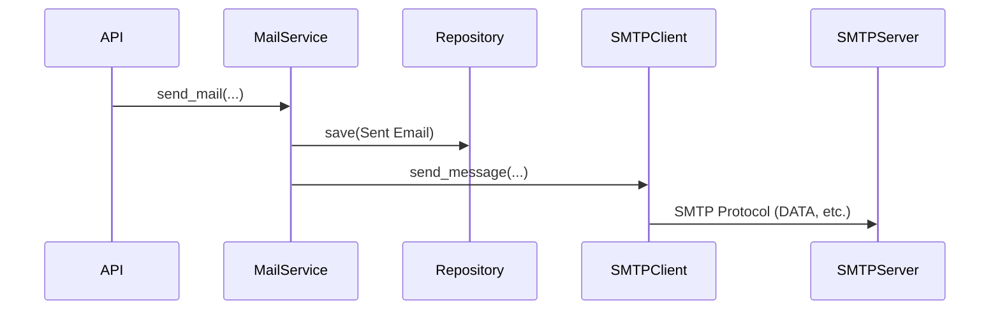
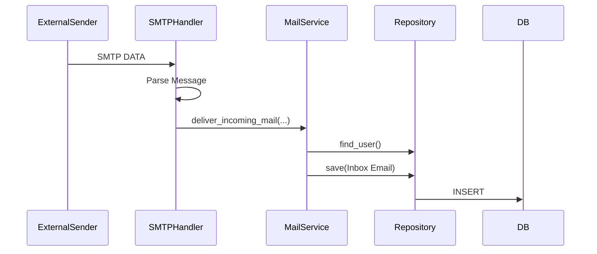

# Sandesh - Local First Email System

## Architecture

Sandesh follows a strict layered architecture to ensure separation of concerns, modularity, and testability.

### Layers

1.  **Core (Domain Layer)**: `backend/core/`
    *   Contains pure Python Domain Entities (`User`, `Email`, `Folder`) and Value Objects (`EmailAddress`).
    *   Defines custom Exceptions.
    *   Has NO dependencies on frameworks (FastAPI, SQLAlchemy) or infrastructure.

2.  **Services (Business Logic Layer)**: `backend/services/`
    *   Orchestrates application behavior (`MailService`, `UserService`, `AuthService`).
    *   Implements business rules (e.g., authentication, folder creation policies).
    *   Uses Repositories to access data.
    *   Uses Infrastructure adapters (e.g., `SMTPClient`) to interact with the outside world.
    *   Framework agnostic.

3.  **Infrastructure (Adapter Layer)**: `backend/infrastructure/`
    *   **DB**: `backend/infrastructure/db/` - SQLAlchemy models, session management, and concrete Repository implementations.
    *   **SMTP**: `backend/infrastructure/smtp/` - `SMTPClient` for sending mail and `SMTPHandler` for receiving mail.
    *   **Security**: `backend/infrastructure/security/` - Password hashing and JWT token management.
    *   This layer isolates the application from external tools and libraries.

4.  **API (Transport Layer)**: `backend/api/`
    *   FastAPI routes and dependency injection (`deps.py`).
    *   Handles HTTP requests/responses and serialization (Pydantic models).
    *   Delegates all logic to Services.

### Folder Structure

```
backend/
├── api/              # API Routes
│   ├── deps.py       # Dependency Injection
│   ├── auth.py
│   ├── mail.py
│   └── ...
├── core/             # Domain Entities
│   ├── entities/
│   ├── value_objects/
│   └── exceptions.py
├── services/         # Business Logic
│   ├── mail_service.py
│   ├── user_service.py
│   └── ...
├── infrastructure/   # Adapters
│   ├── db/
│   │   ├── repositories.py
│   │   └── models.py
│   ├── smtp/
│   │   ├── smtp_client.py
│   │   └── smtp_server.py
│   └── security/
├── config.py
├── main.py
└── requirements.txt
```

### SMTP Flow

#### Sending Mail
1.  **API** receives send request.
2.  **MailService** creates a copy in the "Sent" folder via `EmailRepository`.
3.  **MailService** uses `SMTPClient` to relay the message to the local SMTP server (localhost:2525).
4.  `SMTPClient` wraps `smtplib` to keep low-level details out of the service layer.



#### Receiving Mail
1.  **SMTP Server** (running in background) receives a message.
2.  **SMTPHandler** parses the message.
3.  **SMTPHandler** instantiates a fresh `MailService` and Repositories with a new DB session.
4.  **SMTPHandler** calls `MailService.deliver_incoming_mail(...)`.
5.  **MailService** looks up the user and saves the email to the "Inbox" via `EmailRepository`.



### Database & Persistence

*   **SQLite** is the sole database.
*   **SQLAlchemy** is used for ORM.
*   **Separation**:
    *   `core/entities` are pure Python dataclasses.
    *   `infrastructure/db/models` are SQLAlchemy classes.
    *   `infrastructure/db/repositories` handle the mapping between them.
*   **SMTP Decoupling**: The SMTP server does not write SQL directly. It uses the `MailService`, ensuring all business rules (like auto-creating inboxes) are applied consistently.

